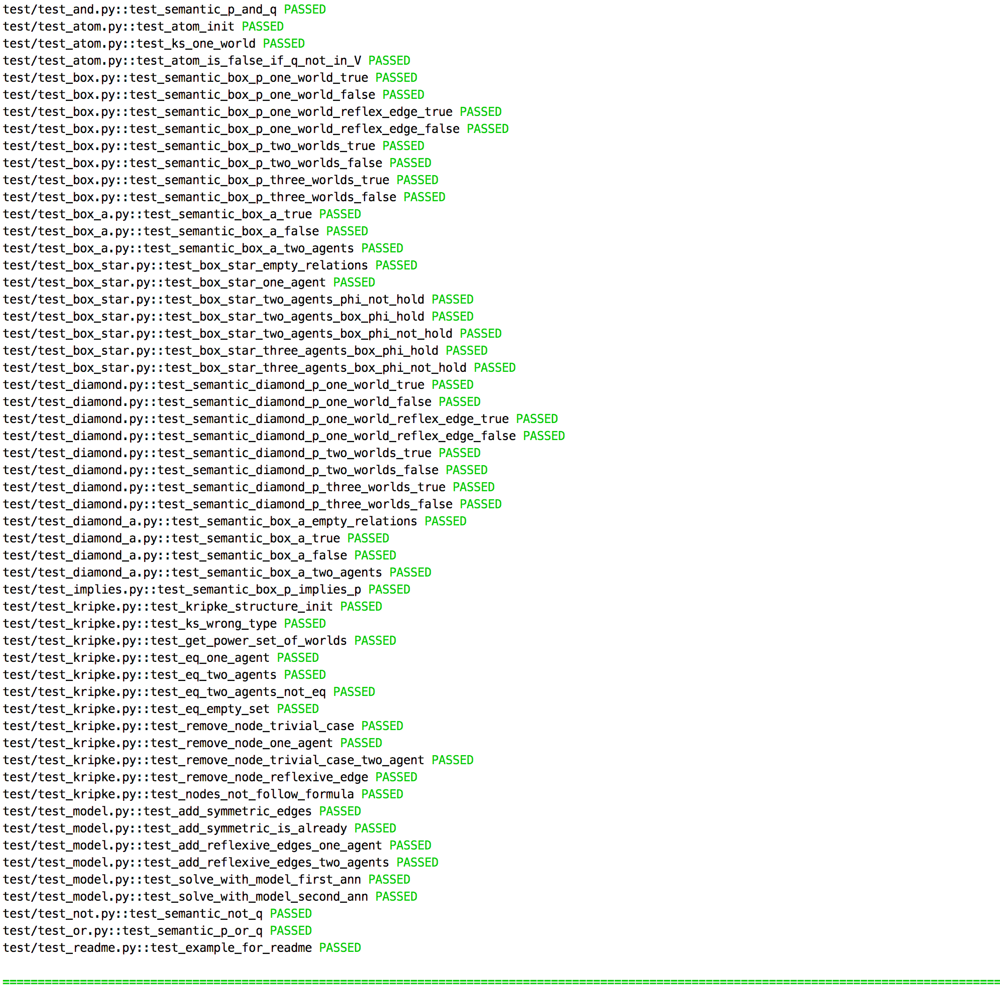

Framework for modelling Kripke structure and modal logic formula
================================================================
[](https://travis-ci.org/erohkohl/ai-modal-logic)
[](https://codecov.io/gh/erohkohl/ai-modal-logic)

Provides a small framework for modelling ks and modal logic formulas


#### Modelling Kripke structure
TODO definition of kss


```python
worlds = [
  World('1', {'p': True, 'q': True}),
  World('2', {'p': True}),
  World('3', {'q': True})
]

relations = {('1', '2'), ('2', '1'), ('1', '3'), ('3', '3')}
ks = KripkeStructure(worlds, relations)
```

#### Describe modal logic formula and check it's semantic over one world


```python
formula = Implies(
  Diamond(Atom('p')),
  And(
    Box(Box(Atom('q'))),
    Diamond(Atom('q'))
  )
)

assert True == formula.semantic(ks, '1')
```

#### Modelchecking
get KS with all worlds forces formula
```python
model = ks.solve(formula)
```

#### Modelling multimodal logic

#### Example: Three wise men with hat


#### Testdriven development
```bash
$ py.test -v
```


