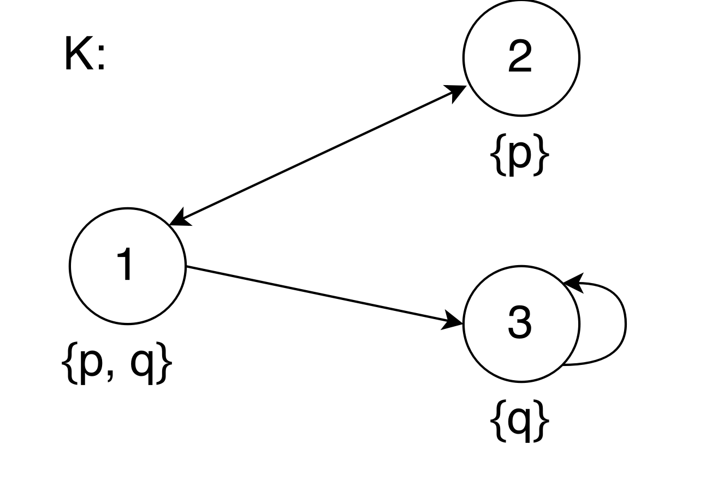
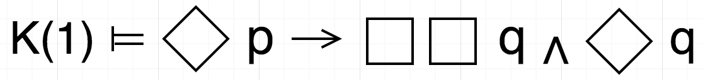
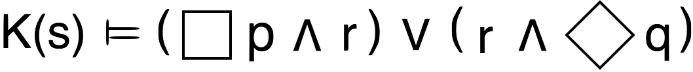
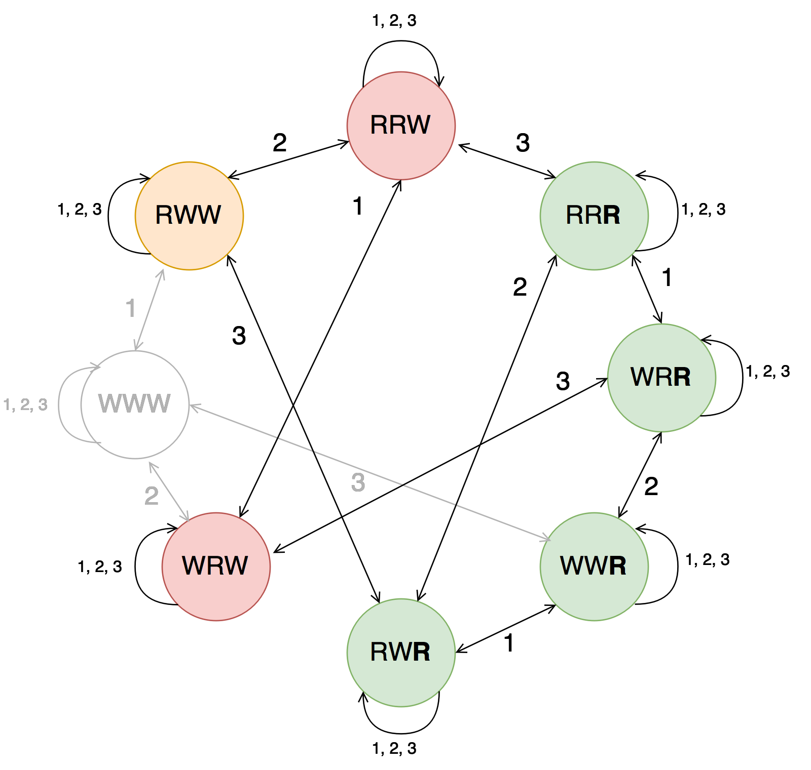

Modal logic solver
================================================================
### Framework for modelling Kripke structures and solving modal logic formulas 
[](https://travis-ci.org/erohkohl/mlsolver) [](https://codecov.io/gh/erohkohl/mlsolver)

This framework provides a tool for modelling Kripke structures and solving modal
logic formulas in **Python 3.6**. The aim of this framework is to describe the knowledge base of a multi agent system and its model, after one agent made an announcement. This knowledge base is mapped by a Kripke structure and one agents announcement is wrapped in a multi modal logic formula.

#### Modelling Kripke structure
A Kripke Frame describes a simple directed graph and its extension, Kripke structure,
assigns to each node a subset of propositional variables. In Kripke's semantic a node is called world, because it describes one possible scenario of the real world. A propositional variable is true in one world, if it is in the world's assigned subset of variables.



The following code snipped shows, how you can build the above Kripke structure with this framework. The Python syntax allows to model the transition relation of a Kripke frame very similar to its mathematical description. To model a valid Kripke frame, you have to ensure, that each node name of the transition relation appears in the list of worlds.

```python
from mlsolver.kripke import World, KripkeStructure

worlds = [
  World('1', {'p': True, 'q': True}),
  World('2', {'p': True, 'q': False}),
  World('3', {'p': False, 'q': True})
]

relations = {('1', '2'), ('2', '1'), ('1', '3'), ('3', '3')}
ks = KripkeStructure(worlds, relations)
```
I decided to model the set of propositional variables as dict, therefore it is not necessary to explicit assign false to a variable.  Moreover ```World('2', {'p': False})``` and ```World('2', {})``` are equivalent.

#### Describe modal logic formula and check its semantic over one world
Further more this framework allows you to check wether a node of your Kripke structure forces a given modal logic formula. Therefore you can map a formula with this framework as following code snipped shows. To calculate the semantic of a modal logic formula over one world just call *semantic()*, pass in the Kripke structure and the name of the world, you want to check.



```python
from mlsolver.formula import *

formula = Implies(
  Diamond(Atom('p')),
  And(
    Box(Box(Atom('q'))),
    Diamond(Atom('q'))
  )
)

assert formula.semantic(ks, '1') is True
```

#### Solve modal logic formula with tableau calculus
A common challenge in artificial intelligence is, to determine a valid Kripke
structure to a given modal logic formula. Therefore the modal logic tableau
calculus gives us a tool, that constructs a Kripke structure starting from
one world. If the formula is satisfiable, it is true in this world. Imagine we
are searching for a valid Kripke structure, that satisfies the below formula
in the world *s*. The only thing to do, is to build this formula, like we already
saw in the snippet above, pass it to an instance of ProofTree and call the *derive()*
method. To check, whether the resolved Kripke structure really satisfies the formula
in world s, you can again make use of Formula's semantic() function.



```python
from mlsolver.tableau import *
from mlsolver.formula import ProofTree

formula = Or(
    And(Box(Atom('p')), Atom('r'))
    , And(Atom('r'), Diamond(Atom('q')))
)
pt = ProofTree(formula)
pt.derive()

print(pt)
assert formula.semantic(pt.kripke_structure, 's') is True
```

**Output:**

```bash
Proof tree
==========
s:((☐ p ∧ r) ∨ (r ∧ ◇ q))
   |
   |_ s:(☐ p ∧ r)
      |
      |_ s:☐ p
         |
         |_ s:r
   |
   |_ s:(r ∧ ◇ q)
      |
      |_ s:r
         |
         |_ s:◇ q
            |
          (s, t)
            | 
            |_ t:q


Kripke structure


Kripke structure
================
(W = {(s,{'r': True})}, R = set())
```

The output shows, that the tableau calculus determines two possible Kripke
structures, because both paths are not closed. Thus the second satisfiable Kripke
structure would be ```(W = {(s,{'r': True}), (t,{'q': True})}, R = set(('s', 't')))```.
One path is closed, if there is a conflict in one worlds partial assignment. The bottom
symbol ```-|``` at the end of a leaf indicates a closed path (see snippet below).

```bash
s:((p ∨ q) ∧ ￢(p -> q))
   |
   |_ s:(p ∨ q)
   |
   |_ s:￢(p -> q)
      |
      |_ s:p
         |
         |_ s:p
            |
            |_ s: ￢q
      |
      |_ s:q
         |
         |_ s:p
            |
            |_ s: ￢q -| # this path is closed
```


#### Modelchecking
Moreover this framework allows to process new knowledge in addition to the current knowledge base, thus it applies a modal logic formula to a Kripke structure (knowledge base) and returns a model. This model is a valid Kripke structure, in terms all of its worlds forces the formula. Therefore the function *solve()* removes the minimum subset of worlds, that prevent the Kripke structure to force the formula.

```python
model = ks.solve(formula)
```

#### Modelling multi agent systems
Further this framework extends the classical modal logic by the semantics of Box_a and Diamond_a operators for describing multi agent systems. You can find their implementation in the Pyhton file [mlsolver.formula](https://github.com/erohkohl/mlsolver/blob/master/src/formula.py). To use this operators it is necessary to build a Kripke structure with additional transition relations for each agent. To illustrate the usage of the framework's multi modal logic implementation, I implemented the *three wise men puzzle*.

##### Example: Three wise men with hat
The data model of this example is located in [mlsolver.model](https://github.com/erohkohl/mlsolver/blob/master/src/model.py) and the Pyhton file [test_model.py](https://github.com/erohkohl/mlsolver/blob/master/test/test_model.py) proves its results.

This puzzle is about three wise men, all of them wear either a red or a white hat. All in all there are two white and three red hats. Each wise men is only able to see the hats of his two neighbors and has to guess the color of his own hat. You can see the Kripke structure, that describes this knowledge base, in the picture below. For example the world name *RWW* denotes, that in this scenario the first wise man wears a red hat, the second and third wise man a white hat. The transition relation is defined by equivalence of two worlds for one agent. For example World *RWW* and *RRW* are equivalent for agent 2, because he can't distinguish these two possible scenarios.



The first wise man announces, that he doesn't know the color of his hat. This announcement implies, that either the second or third wise men has to wear a red hat. The first wise man would only be able to know the color of his hat, in case all of his neighbors wear white hats. Therefore we add the following formula to their knowledge base and apply it to the Kirpke structure. This model contains all worlds of the original Kirpke structure expect *WWW* and *RWW*.

```python
# First announcement implies, that second or third wise men wears a red hat
f = Box_star(Or(Atom('2:R'), Atom('3:R')))
model = ks.solve(f)
```

 The second wise man admits, that he also doesn't know the color of his hat, although he knows, that he or the third wise man has to wear a red hat. This announcement implies, that the third wise man knows his hat color. Thus the model of this formula only contains the green worlds.

```python
# Second announcement implies, that third wise men knows color of his hat
g = Box_a('3', Atom('3:R')
model = ks.solve(And(f, g))
```

#### Test-driven development

While developing this framework I made use of the test-driven approach. Thus this repository contains **106 py.test cases** to ensure, that the framework works as expected, and for documentation purposes. Before you are able to run all tests, make sure you have installed the setup.py, which only contains py.test as dependency, and you use **Python 3.6**.

```bash
$ python setup.py install
$ py.test -vv
```
